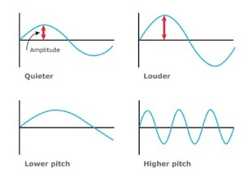
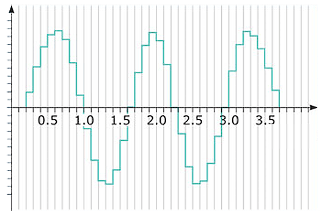

Step 1 - Capturing audio input
------------------------------
In order to work with sound we need to capture it.
Sound is a vibration and can be represented as a sinusoid wave.

The main characteristics of a sound wave are:
 - Amplitude. The bigger amplitude we have  the louder sound we hear.
 - Frequency. The higher frequency  the higher pitch we hear.

So how is sound captured?
The real microphone is capturing the value of amplitude every 1/44100 sec (44100 is just an example number), and we
get something like this.

Why we used 1/44100 sec in the example? "1/44100" is a [Sample Rate](https://en.wikipedia.org/wiki/Sampling_\(signal_processing\)#Sampling_rate).
The fact that we capture sound every 1/44100 sec
due to [Nyquist theorem](https://en.wikipedia.org/wiki/Nyquist%E2%80%93Shannon_sampling_theorem)
means that we can capture sound in 0Hz - 22500Hz diapasone (22500 = 44100/2).
And 22500Hz - is the highest pitch that human can hear, so we do not need to capture sound more frequentnly then 44100 Hz.
44100 Hz - is a standard sample rate in music staff.

